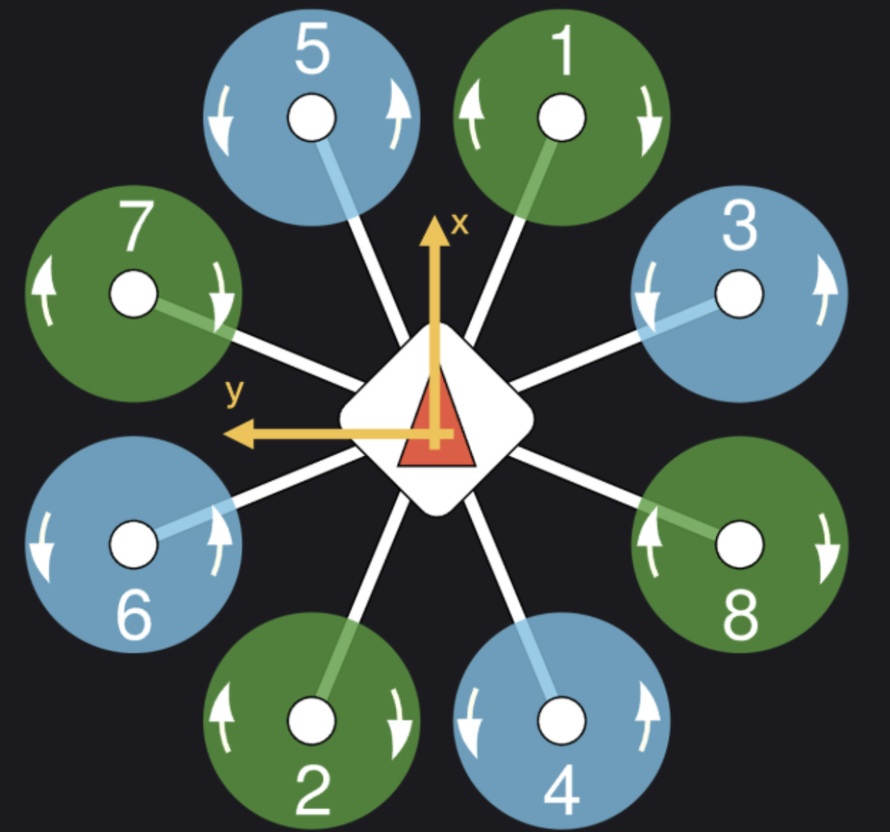

# Gazebo Model for the T18 Octorotor
The Gazebo model files for the T18 octorotor were created using the `x500` and `x500_mono_cam` found in `~/PX4-Autopilot/Tools/simulation/gz/models` as the template. There are three folders that create the `x500_mono_cam` drone:
- `x500_base` which defines the geometry, mass, collision, and imports CAD models
- `x500` which takes the `x500_base` model and adds motor simulation plugins.
- `x500_mono_cam` which takes the `x500` model and attaches a monocular camera (`mono_cam`) model.
Each folder contains a `model.config` file and a `model.sdf` file. The details of each folders are expalined below.

## `x500_mono_cam` `model.sdf` File
The `x500_mono_cam` model is a composite model that combines the base drone `x500` and the monocular camera model `mono_cam`.

### Full Code for `x500_mono_cam` `model.sdf`
```xml
<?xml version="1.0" encoding="UTF-8"?>
<sdf version='1.9'>
  <model name='x500_mono_cam'>
    <include merge='true'>
      <uri>x500</uri>
    </include>
    <include merge='true'>
      <uri>model://mono_cam</uri>
      <pose>.12 .03 .242 0 0 0</pose>
    </include>
    <joint name="CameraJoint" type="fixed">
      <parent>base_link</parent>
      <child>mono_cam/base_link</child>
      <pose relative_to="base_link">.12 .03 .242 0 0 0</pose>
    </joint>
  </model>
</sdf>
```
### `x500_mono_cam` `model.sdf` Details
```xml
<?xml version="1.0" encoding="UTF-8"?>
<sdf version='1.9'>
  <model name='x500_mono_cam'>
```
Defines the new sdf model called `x500_mono_cam`.
```xml
    <include merge='true'>
      <uri>x500</uri>
    </include>
```
Includes the `x500` model as the base of the composite model.
```xml
    <include merge='true'>
      <uri>model://mono_cam</uri>
      <pose>.12 .03 .242 0 0 0</pose>
    </include>
```
Includes the monocular camera to the model, positioned at (x y z roll pictch yaw) = (.12 .03 .242 0 0 0) relative to origin of `x500`.
```xml
    <joint name="CameraJoint" type="fixed">
      <parent>base_link</parent>
      <child>mono_cam/base_link</child>
      <pose relative_to="base_link">.12 .03 .242 0 0 0</pose>
    </joint>
```
Creates a fixed joint that connects the `base_link` of the `x500` and the `mono_cam`.

## `x500` `model.sdf` File
The `x500` model takes the `x500_base` model and adds motor simulation plugins.

### Full Code for `x500` `model.sdf`
```xml
<?xml version="1.0" encoding="UTF-8"?>
<sdf version='1.9'>
  <model name='x500'>
    <include merge='true'>
      <uri>model://x500_base</uri>
    </include>
    <plugin filename="gz-sim-multicopter-motor-model-system" name="gz::sim::systems::MulticopterMotorModel">
      <jointName>rotor_0_joint</jointName>
      <linkName>rotor_0</linkName>
      <turningDirection>ccw</turningDirection>
      <timeConstantUp>0.0125</timeConstantUp>
      <timeConstantDown>0.025</timeConstantDown>
      <maxRotVelocity>1000.0</maxRotVelocity>
      <motorConstant>8.54858e-06</motorConstant>
      <momentConstant>0.016</momentConstant>
      <commandSubTopic>command/motor_speed</commandSubTopic>
      <motorNumber>0</motorNumber>
      <rotorDragCoefficient>8.06428e-05</rotorDragCoefficient>
      <rollingMomentCoefficient>1e-06</rollingMomentCoefficient>
      <rotorVelocitySlowdownSim>10</rotorVelocitySlowdownSim>
      <motorType>velocity</motorType>
    </plugin>
    <plugin filename="gz-sim-multicopter-motor-model-system" name="gz::sim::systems::MulticopterMotorModel">
      <jointName>rotor_1_joint</jointName>
      <linkName>rotor_1</linkName>
      <turningDirection>ccw</turningDirection>
      <timeConstantUp>0.0125</timeConstantUp>
      <timeConstantDown>0.025</timeConstantDown>
      <maxRotVelocity>1000.0</maxRotVelocity>
      <motorConstant>8.54858e-06</motorConstant>
      <momentConstant>0.016</momentConstant>
      <commandSubTopic>command/motor_speed</commandSubTopic>
      <motorNumber>1</motorNumber>
      <rotorDragCoefficient>8.06428e-05</rotorDragCoefficient>
      <rollingMomentCoefficient>1e-06</rollingMomentCoefficient>
      <rotorVelocitySlowdownSim>10</rotorVelocitySlowdownSim>
      <motorType>velocity</motorType>
    </plugin>
    <plugin filename="gz-sim-multicopter-motor-model-system" name="gz::sim::systems::MulticopterMotorModel">
      <jointName>rotor_2_joint</jointName>
      <linkName>rotor_2</linkName>
      <turningDirection>cw</turningDirection>
      <timeConstantUp>0.0125</timeConstantUp>
      <timeConstantDown>0.025</timeConstantDown>
      <maxRotVelocity>1000.0</maxRotVelocity>
      <motorConstant>8.54858e-06</motorConstant>
      <momentConstant>0.016</momentConstant>
      <commandSubTopic>command/motor_speed</commandSubTopic>
      <motorNumber>2</motorNumber>
      <rotorDragCoefficient>8.06428e-05</rotorDragCoefficient>
      <rollingMomentCoefficient>1e-06</rollingMomentCoefficient>
      <rotorVelocitySlowdownSim>10</rotorVelocitySlowdownSim>
      <motorType>velocity</motorType>
    </plugin>
    <plugin filename="gz-sim-multicopter-motor-model-system" name="gz::sim::systems::MulticopterMotorModel">
      <jointName>rotor_3_joint</jointName>
      <linkName>rotor_3</linkName>
      <turningDirection>cw</turningDirection>
      <timeConstantUp>0.0125</timeConstantUp>
      <timeConstantDown>0.025</timeConstantDown>
      <maxRotVelocity>1000.0</maxRotVelocity>
      <motorConstant>8.54858e-06</motorConstant>
      <momentConstant>0.016</momentConstant>
      <commandSubTopic>command/motor_speed</commandSubTopic>
      <motorNumber>3</motorNumber>
      <rotorDragCoefficient>8.06428e-05</rotorDragCoefficient>
      <rollingMomentCoefficient>1e-06</rollingMomentCoefficient>
      <rotorVelocitySlowdownSim>10</rotorVelocitySlowdownSim>
      <motorType>velocity</motorType>
    </plugin>
  </model>
</sdf>
```

### `x500` `model.sdf` Details
```xml
    <include merge='true'>
      <uri>model://x500_base</uri>
    </include>
```
Includes the `x500_base` model.
```xml
    <plugin filename="gz-sim-multicopter-motor-model-system" name="gz::sim::systems::MulticopterMotorModel">
      <jointName>rotor_0_joint</jointName>
      <linkName>rotor_0</linkName>
      <turningDirection>ccw</turningDirection>
      <timeConstantUp>0.0125</timeConstantUp>
      <timeConstantDown>0.025</timeConstantDown>
      <maxRotVelocity>1000.0</maxRotVelocity>
      <motorConstant>8.54858e-06</motorConstant>
      <momentConstant>0.016</momentConstant>
      <commandSubTopic>command/motor_speed</commandSubTopic>
      <motorNumber>0</motorNumber>
      <rotorDragCoefficient>8.06428e-05</rotorDragCoefficient>
      <rollingMomentCoefficient>1e-06</rollingMomentCoefficient>
      <rotorVelocitySlowdownSim>10</rotorVelocitySlowdownSim>
      <motorType>velocity</motorType>
    </plugin>
```
Adds motor dynamics for each rotor using motor simulation plugis.
`<joint name>` - name of the joint in the `x500_base` model
`<linkname>` - the link connected to the joint in the `x500_base` model 
`<turningDirection>` - motor turning direction (cw or ccw)
`<timeConstantUp>` - simulates motor acceleration responsiveness. time constant for motor spin-up.
`<timeConstantDown>`- time constant for spin-down
`<maxRotVelocity>` - max RPM (rad/s) before clipping
`<motorConstant>` - maps motor input (PWM or command) to thrust (N/(rad/s)^2)
`<momentConstant>` - maps motor thrust to torque
`<commandSubTopic>` - ROS2/Gazebo transport topic where PX4 sends motor commands
`<motorNumber>` -index of the motor
`<rotorDragCoefficient>` - drag coefficient for simulating drag force due to spinning rotor
`<rollingMomentCoefficient>` - rolling coefficient for rolling torques
`<rotorVelocitySlowdownSim>` - scales down rotor velocity to align with simulation. simulates gear ratio
`<motorType>` - specifies the motor control type. `velocity` means PX4 sends angular velocity commands

## `x500_base` `model.sdf` File
The `x500_base` model defines the geometry, mass, collision, and imports CAD models.
 
### Full Code for `x500_base` `model.sdf`
```xml
<?xml version="1.0" encoding="UTF-8"?>
<sdf version='1.9'>
  <model name='x500_base'>
    <pose>0 0 .24 0 0 0</pose>
    <self_collide>false</self_collide>
    <static>false</static>
    <link name="base_link">
      <inertial>
        <mass>2.0</mass>
        <inertia>
          <ixx>0.02166666666666667</ixx>
          <ixy>0</ixy>
          <ixz>0</ixz>
          <iyy>0.02166666666666667</iyy>
          <iyz>0</iyz>
          <izz>0.04000000000000001</izz>
        </inertia>
      </inertial>
      <gravity>true</gravity>
      <velocity_decay/>
      <visual name="base_link_visual">
        <pose>0 0 .025 0 0 3.141592654</pose>
        <geometry>
          <mesh>
            <scale>1 1 1</scale>
            <uri>model://x500_base/meshes/NXP-HGD-CF.dae</uri>
          </mesh>
        </geometry>
      </visual>
      <visual name="5010_motor_base_0">
        <pose>0.174 0.174 .032 0 0 -.45</pose>
        <geometry>
          <mesh>
            <scale>1 1 1</scale>
            <uri>model://x500_base/meshes/5010Base.dae</uri>
          </mesh>
        </geometry>
      </visual>
      <visual name="5010_motor_base_1">
        <pose>-0.174 0.174 .032 0 0 -.45</pose>
        <geometry>
          <mesh>
            <scale>1 1 1</scale>
            <uri>model://x500_base/meshes/5010Base.dae</uri>
          </mesh>
        </geometry>
      </visual>
      <visual name="5010_motor_base_2">
        <pose>0.174 -0.174 .032 0 0 -.45</pose>
        <geometry>
          <mesh>
            <scale>1 1 1</scale>
            <uri>model://x500_base/meshes/5010Base.dae</uri>
          </mesh>
        </geometry>
      </visual>
      <visual name="5010_motor_base_3">
        <pose>-0.174 -0.174 .032 0 0 -.45</pose>
        <geometry>
          <mesh>
            <scale>1 1 1</scale>
            <uri>model://x500_base/meshes/5010Base.dae</uri>
          </mesh>
        </geometry>
      </visual>
      <visual name="NXP_FMUK66_FRONT">
        <pose>0.047 .001 .043 1 0 1.57</pose>
        <cast_shadows>false</cast_shadows>
        <geometry>
          <plane>
            <normal>0 0 1</normal>
            <size>.013 .007</size>
          </plane>
        </geometry>
        <material>
          <diffuse>1.0 1.0 1.0</diffuse>
          <specular>1.0 1.0 1.0</specular>
          <pbr>
            <metal>
              <albedo_map>model://x500_base/materials/textures/nxp.png</albedo_map>
            </metal>
          </pbr>
        </material>
      </visual>
      <visual name="NXP_FMUK66_TOP">
        <pose>-0.023 0 .0515 0 0 -1.57</pose>
        <cast_shadows>false</cast_shadows>
        <geometry>
          <plane>
            <normal>0 0 1</normal>
            <size>.013 .007</size>
          </plane>
        </geometry>
        <material>
          <diffuse>1.0 1.0 1.0</diffuse>
          <specular>1.0 1.0 1.0</specular>
          <pbr>
            <metal>
              <albedo_map>model://x500_base/materials/textures/nxp.png</albedo_map>
            </metal>
          </pbr>
        </material>
      </visual>
      <visual name="RDDRONE_FMUK66_TOP">
        <pose>-.03 0 .0515 0 0 -1.57</pose>
        <cast_shadows>false</cast_shadows>
        <geometry>
          <plane>
            <normal>0 0 1</normal>
            <size>.032 .0034</size>
          </plane>
        </geometry>
        <material>
          <diffuse>1.0 1.0 1.0</diffuse>
          <specular>1.0 1.0 1.0</specular>
          <pbr>
            <metal>
              <albedo_map>model://x500_base/materials/textures/rd.png</albedo_map>
            </metal>
          </pbr>
        </material>
      </visual>
      <collision name="base_link_collision_0">
        <pose>0 0 .007 0 0 0</pose>
        <geometry>
          <box>
            <size>0.35355339059327373 0.35355339059327373 0.05</size>
          </box>
        </geometry>
        <surface>
          <contact>
            <ode>
              <min_depth>0.001</min_depth>
              <max_vel>0</max_vel>
            </ode>
          </contact>
          <friction>
            <ode/>
          </friction>
        </surface>
      </collision>
      <collision name="base_link_collision_1">
        <pose>0 -0.098 -.123 -0.35 0 0</pose>
        <geometry>
          <box>
            <size>0.015 0.015 0.21</size>
          </box>
        </geometry>
        <surface>
          <contact>
            <ode>
              <min_depth>0.001</min_depth>
              <max_vel>0</max_vel>
            </ode>
          </contact>
          <friction>
            <ode/>
          </friction>
        </surface>
      </collision>
      <collision name="base_link_collision_2">
        <pose>0 0.098 -.123 0.35 0 0</pose>
        <geometry>
          <box>
            <size>0.015 0.015 0.21</size>
          </box>
        </geometry>
        <surface>
          <contact>
            <ode>
              <min_depth>0.001</min_depth>
              <max_vel>0</max_vel>
            </ode>
          </contact>
          <friction>
            <ode/>
          </friction>
        </surface>
      </collision>
      <collision name="base_link_collision_3">
        <pose>0 -0.132 -.2195 0 0 0</pose>
        <geometry>
          <box>
            <size>0.25 0.015 0.015</size>
          </box>
        </geometry>
        <surface>
          <contact>
            <ode>
              <min_depth>0.001</min_depth>
              <max_vel>0</max_vel>
            </ode>
          </contact>
          <friction>
            <ode/>
          </friction>
        </surface>
      </collision>
      <collision name="base_link_collision_4">
        <pose>0 0.132 -.2195 0 0 0</pose>
        <geometry>
          <box>
            <size>0.25 0.015 0.015</size>
          </box>
        </geometry>
        <surface>
          <contact>
            <ode>
              <min_depth>0.001</min_depth>
              <max_vel>0</max_vel>
            </ode>
          </contact>
          <friction>
            <ode/>
          </friction>
        </surface>
      </collision>
      <sensor name="air_pressure_sensor" type="air_pressure">
        <always_on>1</always_on>
        <update_rate>50</update_rate>
        <air_pressure>
          <pressure>
            <noise type="gaussian">
              <mean>0</mean>
              <stddev>0.01</stddev>
            </noise>
          </pressure>
        </air_pressure>
      </sensor>
      <sensor name="imu_sensor" type="imu">
        <always_on>1</always_on>
        <update_rate>250</update_rate>
        <imu>
          <angular_velocity>
            <x>
              <noise type="gaussian">
                <mean>0</mean>
                <stddev>0.00018665</stddev>
                <dynamic_bias_stddev>3.8785e-05</dynamic_bias_stddev>
                <dynamic_bias_correlation_time>1000</dynamic_bias_correlation_time>
              </noise>
            </x>
            <y>
              <noise type="gaussian">
                <mean>0</mean>
                <stddev>0.00018665</stddev>
                <dynamic_bias_stddev>3.8785e-05</dynamic_bias_stddev>
                <dynamic_bias_correlation_time>1000</dynamic_bias_correlation_time>
              </noise>
            </y>
            <z>
              <noise type="gaussian">
                <mean>0</mean>
                <stddev>0.00018665</stddev>
                <dynamic_bias_stddev>3.8785e-05</dynamic_bias_stddev>
                <dynamic_bias_correlation_time>1000</dynamic_bias_correlation_time>
              </noise>
            </z>
          </angular_velocity>
          <linear_acceleration>
            <x>
              <noise type="gaussian">
                <mean>0</mean>
                <stddev>0.00186</stddev>
                <dynamic_bias_stddev>0.006</dynamic_bias_stddev>
                <dynamic_bias_correlation_time>300</dynamic_bias_correlation_time>
              </noise>
            </x>
            <y>
              <noise type="gaussian">
                <mean>0</mean>
                <stddev>0.00186</stddev>
                <dynamic_bias_stddev>0.006</dynamic_bias_stddev>
                <dynamic_bias_correlation_time>300</dynamic_bias_correlation_time>
              </noise>
            </y>
            <z>
              <noise type="gaussian">
                <mean>0</mean>
                <stddev>0.00186</stddev>
                <dynamic_bias_stddev>0.006</dynamic_bias_stddev>
                <dynamic_bias_correlation_time>300</dynamic_bias_correlation_time>
              </noise>
            </z>
          </linear_acceleration>
        </imu>
      </sensor>
      <sensor name="navsat_sensor" type="navsat">
        <always_on>1</always_on>
        <update_rate>30</update_rate>
      </sensor>
    </link>
    <link name="rotor_0">
      <gravity>true</gravity>
      <self_collide>false</self_collide>
      <velocity_decay/>
      <pose>0.174 -0.174 0.06 0 0 0</pose>
      <inertial>
          <mass>0.016076923076923075</mass>
          <inertia>
            <ixx>3.8464910483993325e-07</ixx>
            <iyy>2.6115851691700804e-05</iyy>
            <izz>2.649858234714004e-05</izz>
          </inertia>
        </inertial>
      <visual name="rotor_0_visual">
        <pose>-0.022 -0.14638461538461536 -0.016 0 0 0</pose>
        <geometry>
          <mesh>
            <scale>0.8461538461538461 0.8461538461538461 0.8461538461538461</scale>
            <uri>model://x500_base/meshes/1345_prop_ccw.stl</uri>
          </mesh>
        </geometry>
        <material>
          <script>
            <name>Gazebo/DarkGrey</name>
            <uri>file://media/materials/scripts/gazebo.material</uri>
          </script>
        </material>
      </visual>
      <visual name="rotor_0_visual_motor_bell">
        <pose>0 0 -.032 0 0 0</pose>
        <geometry>
          <mesh>
            <scale>1 1 1</scale>
            <uri>model://x500_base/meshes/5010Bell.dae</uri>
          </mesh>
        </geometry>
      </visual>
      <collision name="rotor_0_collision">
        <pose>0 0 0 0 0 0 </pose>
        <geometry>
          <box>
            <size>0.2792307692307692 0.016923076923076923 0.0008461538461538462</size>
          </box>
        </geometry>
        <surface>
          <contact>
            <ode>
              <min_depth>0.001</min_depth>
              <max_vel>0</max_vel>
            </ode>
          </contact>
          <friction>
            <ode/>
          </friction>
        </surface>
      </collision>
    </link>
    <joint name="rotor_0_joint" type="revolute">
      <parent>base_link</parent>
      <child>rotor_0</child>
      <axis>
        <xyz>0 0 1</xyz>
        <limit>
          <lower>-1e+16</lower>
          <upper>1e+16</upper>
        </limit>
        <dynamics>
          <spring_reference>0</spring_reference>
          <spring_stiffness>0</spring_stiffness>
        </dynamics>
      </axis>
    </joint>
    <link name="rotor_1">
      <gravity>true</gravity>
      <self_collide>false</self_collide>
      <velocity_decay/>
      <pose>-0.174 0.174 0.06 0 0 0</pose>
      <inertial>
          <mass>0.016076923076923075</mass>
          <inertia>
            <ixx>3.8464910483993325e-07</ixx>
            <iyy>2.6115851691700804e-05</iyy>
            <izz>2.649858234714004e-05</izz>
          </inertia>
        </inertial>
      <visual name="rotor_1_visual">
        <pose>-0.022 -0.14638461538461536 -0.016 0 0 0</pose>
        <geometry>
          <mesh>
            <scale>0.8461538461538461 0.8461538461538461 0.8461538461538461</scale>
            <uri>model://x500_base/meshes/1345_prop_ccw.stl</uri>
          </mesh>
        </geometry>
        <material>
          <script>
            <name>Gazebo/DarkGrey</name>
            <uri>file://media/materials/scripts/gazebo.material</uri>
          </script>
        </material>
      </visual>
      <visual name="rotor_1_visual_motor_top">
        <pose>0 0 -.032 0 0 0</pose>
        <geometry>
          <mesh>
            <scale>1 1 1</scale>
            <uri>model://x500_base/meshes/5010Bell.dae</uri>
          </mesh>
        </geometry>
      </visual>
      <collision name="rotor_1_collision">
        <pose>0 0 0 0 0 0 </pose>
        <geometry>
          <box>
            <size>0.2792307692307692 0.016923076923076923 0.0008461538461538462</size>
          </box>
        </geometry>
        <surface>
          <contact>
            <ode>
              <min_depth>0.001</min_depth>
              <max_vel>0</max_vel>
            </ode>
          </contact>
          <friction>
            <ode/>
          </friction>
        </surface>
      </collision>
    </link>
    <joint name="rotor_1_joint" type="revolute">
      <parent>base_link</parent>
      <child>rotor_1</child>
      <axis>
        <xyz>0 0 1</xyz>
        <limit>
          <lower>-1e+16</lower>
          <upper>1e+16</upper>
        </limit>
        <dynamics>
          <spring_reference>0</spring_reference>
          <spring_stiffness>0</spring_stiffness>
        </dynamics>
      </axis>
    </joint>
    <link name="rotor_2">
      <gravity>true</gravity>
      <self_collide>false</self_collide>
      <velocity_decay/>
      <pose>0.174 0.174 0.06 0 0 0</pose>
      <inertial>
          <mass>0.016076923076923075</mass>
          <inertia>
            <ixx>3.8464910483993325e-07</ixx>
            <iyy>2.6115851691700804e-05</iyy>
            <izz>2.649858234714004e-05</izz>
          </inertia>
        </inertial>
      <visual name="rotor_2_visual">
        <pose>-0.022 -0.14638461538461536 -0.016 0 0 0</pose>
        <geometry>
          <mesh>
            <scale>0.8461538461538461 0.8461538461538461 0.8461538461538461</scale>
            <uri>model://x500_base/meshes/1345_prop_cw.stl</uri>
          </mesh>
        </geometry>
        <material>
          <script>
            <name>Gazebo/DarkGrey</name>
            <uri>file://media/materials/scripts/gazebo.material</uri>
          </script>
        </material>
      </visual>
      <visual name="rotor_2_visual_motor_top">
        <pose>0 0 -.032 0 0 0</pose>
        <geometry>
          <mesh>
            <scale>1 1 1</scale>
            <uri>model://x500_base/meshes/5010Bell.dae</uri>
          </mesh>
        </geometry>
      </visual>
      <collision name="rotor_2_collision">
        <pose>0 0 0 0 0 0 </pose>
        <geometry>
          <box>
            <size>0.2792307692307692 0.016923076923076923 0.0008461538461538462</size>
          </box>
        </geometry>
        <surface>
          <contact>
            <ode>
              <min_depth>0.001</min_depth>
              <max_vel>0</max_vel>
            </ode>
          </contact>
          <friction>
            <ode/>
          </friction>
        </surface>
      </collision>
    </link>
    <joint name="rotor_2_joint" type="revolute">
      <parent>base_link</parent>
      <child>rotor_2</child>
      <axis>
        <xyz>0 0 1</xyz>
        <limit>
          <lower>-1e+16</lower>
          <upper>1e+16</upper>
        </limit>
        <dynamics>
          <spring_reference>0</spring_reference>
          <spring_stiffness>0</spring_stiffness>
        </dynamics>
      </axis>
    </joint>
    <link name="rotor_3">
      <gravity>true</gravity>
      <self_collide>false</self_collide>
      <velocity_decay/>
      <pose>-0.174 -0.174 0.06 0 0 0</pose>
      <inertial>
          <mass>0.016076923076923075</mass>
          <inertia>
            <ixx>3.8464910483993325e-07</ixx>
            <iyy>2.6115851691700804e-05</iyy>
            <izz>2.649858234714004e-05</izz>
          </inertia>
        </inertial>
      <visual name="rotor_3_visual">
        <pose>-0.022 -0.14638461538461536 -0.016 0 0 0</pose>
        <geometry>
          <mesh>
            <scale>0.8461538461538461 0.8461538461538461 0.8461538461538461</scale>
            <uri>model://x500_base/meshes/1345_prop_cw.stl</uri>
          </mesh>
        </geometry>
        <material>
          <script>
            <name>Gazebo/DarkGrey</name>
            <uri>file://media/materials/scripts/gazebo.material</uri>
          </script>
        </material>
      </visual>
      <visual name="rotor_3_visual_motor_top">
        <pose>0 0 -.032 0 0 0</pose>
        <geometry>
          <mesh>
            <scale>1 1 1</scale>
            <uri>model://x500_base/meshes/5010Bell.dae</uri>
          </mesh>
        </geometry>
      </visual>
      <collision name="rotor_3_collision">
        <pose>0 0 0 0 0 0 </pose>
        <geometry>
          <box>
            <size>0.2792307692307692 0.016923076923076923 0.0008461538461538462</size>
          </box>
        </geometry>
        <surface>
          <contact>
            <ode>
              <min_depth>0.001</min_depth>
              <max_vel>0</max_vel>
            </ode>
          </contact>
          <friction>
            <ode/>
          </friction>
        </surface>
      </collision>
    </link>
    <joint name="rotor_3_joint" type="revolute">
      <parent>base_link</parent>
      <child>rotor_3</child>
      <axis>
        <xyz>0 0 1</xyz>
        <limit>
          <lower>-1e+16</lower>
          <upper>1e+16</upper>
        </limit>
        <dynamics>
          <spring_reference>0</spring_reference>
          <spring_stiffness>0</spring_stiffness>
        </dynamics>
      </axis>
    </joint>
  </model>
</sdf>
```

### `x500_base` `model.sdf` Details
```xml
  <model name='x500_base'>
    <pose>0 0 .24 0 0 0</pose>
    <self_collide>false</self_collide>
    <static>false</static>
```
Defines a new SDF model called x500_base with its origin at (0,0,0.24) and sets the model to be dynamic (not static) and self-collision disabled.
```xml
    <link name="base_link">
      <inertial>
        <mass>2.0</mass>
        <inertia>
          <ixx>0.02166666666666667</ixx>
          <ixy>0</ixy>
          <ixz>0</ixz>
          <iyy>0.02166666666666667</iyy>
          <iyz>0</iyz>
          <izz>0.04000000000000001</izz>
        </inertia>
      </inertial>
```
Defines the main link base_link with a mass of 2 kg and its inertia tensor.
```xml
      <visual name="base_link_visual">
        <pose>0 0 .025 0 0 3.141592654</pose>
        <geometry>
          <mesh>
            <scale>1 1 1</scale>
            <uri>model://x500_base/meshes/NXP-HGD-CF.dae</uri>
          </mesh>
        </geometry>
      </visual>
```
Adds a visual mesh representing the main body of the drone, positioned slightly above the link origin and rotated by π around the z-axis.
```xml
      <visual name="5010_motor_base_0">
        <pose>0.174 0.174 .032 0 0 -.45</pose>
        <geometry>
          <mesh>
            <scale>1 1 1</scale>
            <uri>model://x500_base/meshes/5010Base.dae</uri>
          </mesh>
        </geometry>
      </visual>
```
Adds a visual mesh for motor 0 at the given pose **relative to** base_link.
Similarly, 5010_motor_base_1 through 5010_motor_base_3 define visuals for the other three motors, each positioned around the main body. Note that the coordinates differ from the PX4 airframe configuration coordinates.

```xml
      <visual name="NXP_FMUK66_FRONT">
        <pose>0.047 .001 .043 1 0 1.57</pose>
        <cast_shadows>false</cast_shadows>
        <geometry>
          <plane>
            <normal>0 0 1</normal>
            <size>.013 .007</size>
          </plane>
        </geometry>
        <material>
          <diffuse>1.0 1.0 1.0</diffuse>
          <specular>1.0 1.0 1.0</specular>
          <pbr>
            <metal>
              <albedo_map>model://x500_base/materials/textures/nxp.png</albedo_map>
            </metal>
          </pbr>
        </material>
      </visual>
```
Adds a plane visual representing the front of the NXP FMUK66 board, with a custom texture applied.
Similarly, NXP_FMUK66_TOP and RDDRONE_FMUK66_TOP define other board visuals with textures.
```xml
      <collision name="base_link_collision_0">
        <pose>0 0 .007 0 0 0</pose>
        <geometry>
          <box>
            <size>0.35355339059327373 0.35355339059327373 0.05</size>
          </box>
        </geometry>
        <surface>
          <contact>
            <ode>
              <min_depth>0.001</min_depth>
              <max_vel>0</max_vel>
            </ode>
          </contact>
          <friction>
            <ode/>
          </friction>
        </surface>
      </collision>
```
Defines a collision box for base_link representing the physical boundaries of the main body.
Similarly, base_link_collision_1 through base_link_collision_4 define additional collision boxes for arms and structural components.
```xml
      <sensor name="air_pressure_sensor" type="air_pressure">
        <always_on>1</always_on>
        <update_rate>50</update_rate>
        <air_pressure>
          <pressure>
            <noise type="gaussian">
              <mean>0</mean>
              <stddev>0.01</stddev>
            </noise>
          </pressure>
        </air_pressure>
      </sensor>
```
Adds an air pressure sensor to the base, always active, updating at 50 Hz, with Gaussian noise of 0.01 Pa standard deviation.
```xml
      <sensor name="imu_sensor" type="imu">
        <always_on>1</always_on>
        <update_rate>250</update_rate>
        <imu>
          <angular_velocity>...</angular_velocity>
          <linear_acceleration>...</linear_acceleration>
        </imu>
      </sensor>
```
Adds an IMU sensor to the base, always active, updating at 250 Hz.
Angular velocity and linear acceleration each have Gaussian noise, dynamic bias, and correlation parameters. The details are removed here for simplicity.
```xml
      <sensor name="navsat_sensor" type="navsat">
        <always_on>1</always_on>
        <update_rate>30</update_rate>
      </sensor>
```
Adds a GNSS/Navigation sensor, always active, updating at 30 Hz.
```xml
    <link name="rotor_0">
      <gravity>true</gravity>
      <self_collide>false</self_collide>
      <velocity_decay/>
      <pose>0.174 -0.174 0.06 0 0 0</pose>
      <inertial>
          <mass>0.016076923076923075</mass>
          <inertia>
            <ixx>3.8464910483993325e-07</ixx>
            <iyy>2.6115851691700804e-05</iyy>
            <izz>2.649858234714004e-05</izz>
          </inertia>
        </inertial>
```
Defines the first rotor link (rotor_0). Sets pose relative to the base_link. Defines mass and intertia of the rotor.
```xml
      <visual name="rotor_0_visual">
        <pose>-0.022 -0.14638461538461536 -0.016 0 0 0</pose>
        <geometry>
          <mesh>
            <scale>0.8461538461538461 0.8461538461538461 0.8461538461538461</scale>
            <uri>model://x500_base/meshes/1345_prop_ccw.stl</uri>
          </mesh>
        </geometry>
        <material>
          <script>
            <name>Gazebo/DarkGrey</name>
            <uri>file://media/materials/scripts/gazebo.material</uri>
          </script>
        </material>
      </visual>
```
Adds a propeller mesh visual, scaled to fit the rotor. The pose is defined relative to the rotor.
```xml
      <visual name="rotor_0_visual_motor_bell">
        <pose>0 0 -.032 0 0 0</pose>
        <geometry>
          <mesh>
            <scale>1 1 1</scale>
            <uri>model://x500_base/meshes/5010Bell.dae</uri>
          </mesh>
        </geometry>
      </visual>
```
Adds the motor bell mesh visual for the rotor.
```xml
      <collision name="rotor_0_collision">
        <pose>0 0 0 0 0 0 </pose>
        <geometry>
          <box>
            <size>0.2792307692307692 0.016923076923076923 0.0008461538461538462</size>
          </box>
        </geometry>
        <surface>
          <contact>
            <ode>
              <min_depth>0.001</min_depth>
              <max_vel>0</max_vel>
            </ode>
          </contact>
          <friction>
            <ode/>
          </friction>
        </surface>
      </collision>
```
Defines the collision box for the rotor.
```xml
    <joint name="rotor_0_joint" type="revolute">
      <parent>base_link</parent>
      <child>rotor_0</child>
      <axis>
        <xyz>0 0 1</xyz>
        <limit>
          <lower>-1e+16</lower>
          <upper>1e+16</upper>
        </limit>
        <dynamics>
          <spring_reference>0</spring_reference>
          <spring_stiffness>0</spring_stiffness>
        </dynamics>
      </axis>
    </joint>
```
Creates a revolute joint connecting the rotor to the base_link, rotating around the z-axis.
Similarly, rotor_1 through rotor_3 are defined.

## Key Changes Made to Create the T18 Octorotor Drone
### Key Changes from `x500_mono_cam` to `t18_mono_cam`
The only changes made were:
- `model name`
- `uri`
- `pose` - determined experimentally

### Key Changes from `x500` to `t18`
Four more rotors were added to make it an octorotor. The key parameters changed were:
- `<turningDirection>` to match the turning direction of each rotor in `t18_base`
- `<motorConstant>` was changed to 8.0e-05 experimentally.

Since `<motorConstant>` was changed experimentally in the simulation and all other parameters were unchanged, it may not reflect the actual t18 parameter, thus, the parameters need to be verified and updated as required.

### Key Changes from `x500_base` to `t18_base`
- The CAD models in `gazebo/gazebo_model/t18_base/meshes` were updated
    - `t18_model.dae` - a new model for the T18 octorotor was created in SolidWorks (all files saved in `gazebo/gazebo_model/cad_t18` and are to scale) and exported as stl. The stl file was imported into Blender, textures were applied, and exported as dae file.
    - `1861_prop_ccw.stl` & `1861_prop_cw.stl` - a new model for the propellers were created. The models are to scale and reflect the actual propellers used for the T18 in the lab.
    - `5010Base.dae` & `5010Bell.dae` - These two files are identical to the ones used for x500. Since they do not have a significant effect to the simulation, the same meshes were used.
- Changes made in `model.sdf`
    - Four more rotors were added
    - Inertial properties (mass and moment of inertia) were updated for the `base_link` and each `rotor` to reflect the properties of T18
    - The pose for all components were updated
