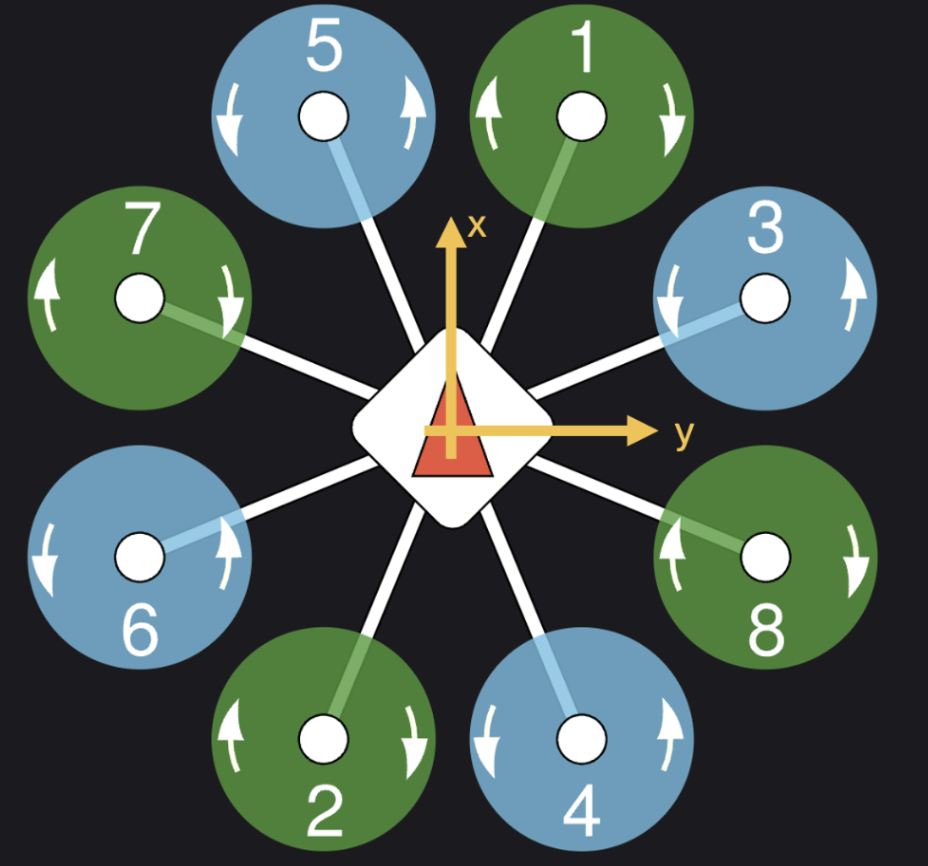

# Airframe Configuration for T18 Octorotor
This folder contains the PX4 airframe configuration file (`4012_gz_t18`) for the T18 octorotor used in Gazebo simulations.
It is based on the existing PX4 configurations `4001_gz_x500` found in `~/PX4-Autopilot/ROMFS/px4fmu_common/init.d-posix/airframes`. `4001_gz_x500` is the standard quadrotor model. The T18 octorotor configuration extends these ideas to an **eight-rotor (octorotor X)** frame.

## `4001_gz_x500` Airframe Configuration File
```sh
#!/bin/sh
#
# @name Gazebo x500
#
# @type Quadrotor
#

. ${R}etc/init.d/rc.mc_defaults

PX4_SIMULATOR=${PX4_SIMULATOR:=gz}
PX4_GZ_WORLD=${PX4_GZ_WORLD:=default}
PX4_SIM_MODEL=${PX4_SIM_MODEL:=x500}

param set-default SIM_GZ_EN 1

param set-default SENS_EN_GPSSIM 1
param set-default SENS_EN_BAROSIM 0
param set-default SENS_EN_MAGSIM 1

param set-default CA_AIRFRAME 0

param set-default CA_ROTOR_COUNT 4

param set-default CA_ROTOR0_PX 0.13
param set-default CA_ROTOR0_PY 0.22
param set-default CA_ROTOR0_KM  0.05

param set-default CA_ROTOR1_PX -0.13
param set-default CA_ROTOR1_PY -0.20
param set-default CA_ROTOR1_KM  0.05

param set-default CA_ROTOR2_PX 0.13
param set-default CA_ROTOR2_PY -0.22
param set-default CA_ROTOR2_KM -0.05

param set-default CA_ROTOR3_PX -0.13
param set-default CA_ROTOR3_PY 0.20
param set-default CA_ROTOR3_KM -0.05

param set-default SIM_GZ_EC_FUNC1 101
param set-default SIM_GZ_EC_FUNC2 102
param set-default SIM_GZ_EC_FUNC3 103
param set-default SIM_GZ_EC_FUNC4 104

param set-default SIM_GZ_EC_MIN1 150
param set-default SIM_GZ_EC_MIN2 150
param set-default SIM_GZ_EC_MIN3 150
param set-default SIM_GZ_EC_MIN4 150

param set-default SIM_GZ_EC_MAX1 1000
param set-default SIM_GZ_EC_MAX2 1000
param set-default SIM_GZ_EC_MAX3 1000
param set-default SIM_GZ_EC_MAX4 1000

param set-default MPC_THR_HOVER 0.60
```
## `4001_gz_x500` Details
```sh
#!/bin/sh
#
# @name Gazebo x500
#
# @type Quadrotor
#
```
Shell script decleration and sets name and type.
```sh
. ${R}etc/init.d/rc.mc_defaults
```
Source PX4 default multicoptor control parameters.
```sh
PX4_SIMULATOR=${PX4_SIMULATOR:=gz}
PX4_GZ_WORLD=${PX4_GZ_WORLD:=default}
PX4_SIM_MODEL=${PX4_SIM_MODEL:=x500}
```
Set default simulator to `gz` (gazebo), default gazebo world to `default.sdf`, and default gazebo model to `x500`.
```sh
param set-default SIM_GZ_EN 1
```
Enable gazebo simulation mode. Activates PX4's Gazebo bridge for simulated vehicle communication.
```sh 
param set-default SENS_EN_GPSSIM 1
```
Enable GPS simulation. Use simulated GPS data.
```ah
param set-default SENS_EN_BAROSIM 0
```
Disables barometer. Use real barometer.
```sh
param set-default SENS_EN_MAGSIM 1
```
Enables magnetometer simulation. Use simulated magnetometer data.
```sh
param set-default CA_AIRFRAME 0
```
Airframe selection. Defines which mixer implementation to use. Selected `0` (Multirotor). See [Control Allocation (Mixing)](https://docs.px4.io/main/en/concept/control_allocation), [CA_AIRFRAME](https://docs.px4.io/main/en/advanced_config/parameter_reference.html#CA_AIRFRAME) for details. 
```sh
param set-default CA_ROTOR_COUNT 4
```
Set the number of rotors to 4 (quadrotor)
```sh
param set-default CA_ROTOR0_PX 0.13
param set-default CA_ROTOR0_PY 0.22
param set-default CA_ROTOR0_KM  0.05

param set-default CA_ROTOR1_PX -0.13
param set-default CA_ROTOR1_PY -0.20
param set-default CA_ROTOR1_KM  0.05

param set-default CA_ROTOR2_PX 0.13
param set-default CA_ROTOR2_PY -0.22
param set-default CA_ROTOR2_KM -0.05

param set-default CA_ROTOR3_PX -0.13
param set-default CA_ROTOR3_PY 0.20
param set-default CA_ROTOR3_KM -0.05
```
`param set-default CA_ROTOR0_PX` sets x position of rotor 0 in metres.\
`param set-default CA_ROTOR0_PY` sets y position of rotor 0 in metres.\
`param set-default CA_ROTOR0_KM` sets moment coefficient of rotor 0. See [Airframe Reference](https://docs.px4.io/main/en/airframes/airframe_reference) for details. Note that the frame defined for PX4 is:

If not specified, a default value of 0.05 is used. +ve for CCW and -ve for CW. Moment coefficient is defined as Torque = KM * Thrust. ([model.yaml](https://github.com/beniaminopozzan/PX4-Autopilot/blob/9b7a8d45685ead479abeed76f8faff61f5832ac4/src/modules/control_allocator/module.yaml#L207-L221))
```sh
param set-default SIM_GZ_EC_FUNC1 101
param set-default SIM_GZ_EC_FUNC2 102
param set-default SIM_GZ_EC_FUNC3 103
param set-default SIM_GZ_EC_FUNC4 104
```
Links PX4 motor outputs to Gazebo motor joints. Assigns each motor to an ESC output.
```sh
param set-default SIM_GZ_EC_MIN1 150
param set-default SIM_GZ_EC_MIN2 150
param set-default SIM_GZ_EC_MIN3 150
param set-default SIM_GZ_EC_MIN4 150

param set-default SIM_GZ_EC_MAX1 1000
param set-default SIM_GZ_EC_MAX2 1000
param set-default SIM_GZ_EC_MAX3 1000
param set-default SIM_GZ_EC_MAX4 1000
```
Sets ESC min/max PWM values in simulation. PWM signal range for motor control. 
Min (150 μs): ESC idle/stop signal.
Max (1000 μs): ESC full power signal.
```sh
param set-default MPC_THR_HOVER 0.60
```
Tells the position controller (MPC) that 60% throttle is needed to hover based on weight-to-power ratio of x500.

## Airframe Configuration File for T18 Octorotor
```sh
#!/bin/sh
#
# @name Gazebo t18 mono cam
#
# @type Octorotor x
#

. ${R}etc/init.d/rc.mc_defaults

PX4_SIMULATOR=${PX4_SIMULATOR:=gz}
PX4_GZ_WORLD=${PX4_GZ_WORLD:=default}
PX4_SIM_MODEL=${PX4_SIM_MODEL:=gz_t18_mono_cam}

param set-default SIM_GZ_EN 1

param set-default SENS_EN_GPSSIM 1
param set-default SENS_EN_BAROSIM 0
param set-default SENS_EN_MAGSIM 1

param set-default CA_AIRFRAME 0

param set-default CA_ROTOR_COUNT 8

param set-default CA_ROTOR0_PX 0.59
param set-default CA_ROTOR0_PY 0.245
param set-default CA_ROTOR0_KM -0.05

param set-default CA_ROTOR1_PX -0.59
param set-default CA_ROTOR1_PY -0.245
param set-default CA_ROTOR1_KM -0.05

param set-default CA_ROTOR2_PX 0.245
param set-default CA_ROTOR2_PY 0.59
param set-default CA_ROTOR2_KM 0.05

param set-default CA_ROTOR3_PX -0.59
param set-default CA_ROTOR3_PY 0.245
param set-default CA_ROTOR3_KM 0.05

param set-default CA_ROTOR4_PX 0.59
param set-default CA_ROTOR4_PY -0.245
param set-default CA_ROTOR4_KM 0.05

param set-default CA_ROTOR5_PX -0.245
param set-default CA_ROTOR5_PY -0.59
param set-default CA_ROTOR5_KM 0.05

param set-default CA_ROTOR6_PX 0.245
param set-default CA_ROTOR6_PY -0.59
param set-default CA_ROTOR6_KM -0.05

param set-default CA_ROTOR7_PX -0.245
param set-default CA_ROTOR7_PY 0.59
param set-default CA_ROTOR7_KM -0.05

param set-default SIM_GZ_EC_FUNC1 101
param set-default SIM_GZ_EC_FUNC2 102
param set-default SIM_GZ_EC_FUNC3 103
param set-default SIM_GZ_EC_FUNC4 104
param set-default SIM_GZ_EC_FUNC5 105
param set-default SIM_GZ_EC_FUNC6 106
param set-default SIM_GZ_EC_FUNC7 107
param set-default SIM_GZ_EC_FUNC8 108

param set-default SIM_GZ_EC_MIN1 150
param set-default SIM_GZ_EC_MIN2 150
param set-default SIM_GZ_EC_MIN3 150
param set-default SIM_GZ_EC_MIN4 150
param set-default SIM_GZ_EC_MIN5 150
param set-default SIM_GZ_EC_MIN6 150
param set-default SIM_GZ_EC_MIN7 150
param set-default SIM_GZ_EC_MIN8 150

param set-default SIM_GZ_EC_MAX1 1000
param set-default SIM_GZ_EC_MAX2 1000
param set-default SIM_GZ_EC_MAX3 1000
param set-default SIM_GZ_EC_MAX4 1000
param set-default SIM_GZ_EC_MAX5 1000
param set-default SIM_GZ_EC_MAX6 1000
param set-default SIM_GZ_EC_MAX7 1000
param set-default SIM_GZ_EC_MAX8 1000

param set-default MPC_THR_HOVER 0.6
param set-default MPC_USE_HTE 1
```
Key Differences from X500
- Frame type: Defined as Octorotor X (# @type Octorotor x).
- Number of rotors set to 8 (CA_ROTOR_COUNT=8).
- Each rotor positions are defined following the [Airframe Reference](https://docs.px4.io/main/en/airframes/airframe_reference)
- ESC mapping:
  - Uses 8 ESC function assignments (SIM_GZ_EC_FUNC1 … SIM_GZ_EC_FUNC8) to link Gazebo motors to PX4 outputs.
- Hover thrust estimation, MPC_USE_HTE, is enabled (1) to improve hover thrust tracking.
  
## Important Note
Note that the ESC min/max PWM and MPC_THR_HOVER values were kept the same as x500 for the purpose of this simulation. However, this may not be an accurate representation of the actual T18 octorotor and may need to be updated.


## Documentations
- [PX4 Gazebo Simulation Documentation](https://docs.px4.io/main/en/sim_gazebo_gz/)
- [Adding a Frame Configuration](https://docs.px4.io/main/en/dev_airframes/adding_a_new_frame.html)
- [Airframes Reference](https://docs.px4.io/main/en/airframes/airframe_reference.html#copter_quadrotor_x_generic_quadcopter)
- [~/PX4-Autopilot/ROMFS/px4fmu_common/init.d-posix
/airframes/](https://github.com/PX4/PX4-Autopilot/tree/main/ROMFS/px4fmu_common/init.d-posix/airframes)
- [Control Allocation (Mixing)](https://docs.px4.io/main/en/concept/control_allocation)
- [Simulation-In-Hardware (SIH)](https://docs.px4.io/main/en/sim_sih/)